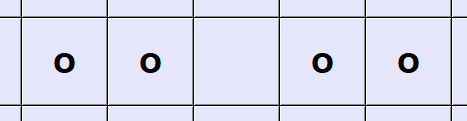

# Домашнее задание для курса "Основы Python". Обратные крестики нолики

## Задача

Разработать игру «Обратные крестики-нолики» на поле 10 x 10 с правилом «Пять в ряд» – проигрывает тот,
у кого получился вертикальный, горизонтальный или диагональный ряд из пяти своих фигур (крестиков/ноликов).
Игра должна работать в режиме «человек против компьютера».
Игра может быть консольной или поддерживать графический интерфейс (будет плюсом, но не требуется).
При разработке игры учесть принцип DRY.

## Решение задачи

### О программе 

Первый ход за игроком. Внизу расположена кнопка для начала новой игры. По её нажатию игровое поле очистится 
и можно будет начать игру заново. Игрок ставит крестики, а компьютер нолики. Проиграет тот, у кого получится ряд
из пяти фигур. Если все поле будет заполнено фигурами и рядов из 5 фигур не будет, то игра заканчивается ничьей.


### Описание кода

#### Объявление переменных и библиотеки

```python
from tkinter import *       # импорт библиотеки для графической реализации игры
import random as random     # импорт рандома для хода компьютера 

game = True                 # в эту переменную будем записывать False при завершении игры, чтобы запретить делать ходы когда уже выявлен победитель 
field = []                  # это будет двумерный список, в котором будут храниться кнопки игрового поля. Ходом будет изменение надписи на кнопке на символ «X» или «O».
x_count = 0                 # количество крестиков на поле, чтобы фиксировать ничью

length = 10                 # длина поля
widht = 10                  # ширина поля
```

#### Описание функций 

##### Графический интерфейс

Функия ниже создает игровое поле. Все элементы графического интерфейса мы будем размещать с помощью упаковщика grid. 
В цикле добавим кнопки игрового поля. Они будут храниться в двумерном списоке. При нажатии на кнопку запускается обработчик click.
При нажатии на копку "Новая игра" запускатеся обработчик new_game.

```python
def print_window():                                                             
    root = Tk()
    root.title('Игра')    
    for row in range(length):
        line = []
        for col in range(widht):
            button = Button(root, text = ' ', width = 4, height = 2, 
                            font = ('Verdana', 20, 'bold'),
                            background = 'lavender',
                            command = lambda row = row, col = col: click(row, col))
            button.grid(row = row, column = col, sticky = 'nsew')
            line.append(button)
        field.append(line)       
    new_button = Button(root, text = 'НАЧАТЬ ЗАНОВО', width = 4, height = 2, 
                        font = ('Verdana', 10, 'bold'),
                        command = new_game)
    new_button.grid(row = 11, column = 3, columnspan = 4, sticky = 'nsew')
    root.mainloop()
```    

##### Обработка нажатия кнопок

Функция new_game будет вызываться при нажатии кнопки начала новой игры. На поле убираются все крестики и нолики. 
Устанавливаем глобальные переменные game_run и cross_count в начальные значения. 

```python
def new_game():                                                                 
    for row in range(length):
        for col in range(widht):
            field[row][col]['text'] = ' '
            field[row][col]['background'] = 'lavender'
    global game
    game = True
    global x_count
    x_count = 0
``` 

Функция click будет вызываться после нажатия на поле, то есть при попытке поставить крестик. 
Если игра еще не завершена, то крестик ставится. После этого увеличиваем счетчик количества выставленных крестиков.

Потом проверяем с помощью функции check_lose, не  проиграли ли мы этим ходом. 
Если еще не выявлен проигравший, и есть еще ходы, то выполняет ход компьютер функцией computer_move, и также после хода идет проверка выигрыша.
Если все поле забито фигурами и не проигравшего, то игра заканчивается ничьей.

```python
def click(row, col):                                                           
    if game and field[row][col]['text'] == ' ':
        field[row][col]['text'] = 'X'
        global x_count
        x_count += 1
        check_lose('X')
        if game and x_count < 51:
            computer_move()
            check_lose('O')
        if x_count == 51:
            messagebox.showinfo("Игра", "Игра закончилась ничьей")
```

##### Проверка проигрыша

Функция check lose осуществляет проверку проигрыша по горизонтали, вертикали и диагонали 

```python
def check_lose(player):                                                         
    horizontal_lose(player)
    vertical_lose(player)
    diagonal_lose(player)
```

Функция horizontal_lose осуществляет проверку проигрыша по горизонтали. В цикле по строкам и столбцам
мы проверяем, нет ли идущих 5 подряд одинаковых фигур. Если такое обнаруживается, то вызывается функия game_over,
которая фиксирует конец игры. 

```python
def horizontal_lose(player):
    series = 0
    for row in range(length):
        for col in range(widht):
            if field[row][col]['text'] == player:
                series += 1
                if series == 5:
                    field[row][col]['background'] = 'pink'
                    game_over(player)
            else: series = 0
        series = 0
```

Аналогично работает функция vertical lose. Измение лишь присутствует в цикле: вложенный цикл по строкам, 
а внешний по стобцам (в horizontal_lose наоборот).

```python
def vertical_lose(player):
    series = 0
    for col in range(length):
        for row in range(widht):
            if field[row][col]['text'] == player:
                series += 1
                if series == 5:
                    field[row][col]['background'] = 'pink'
                    game_over(player)                
            else: series = 0                
        series = 0
```

Функция diagonal_lose осуществляет проверку проигрыша по диагонали. Проверка занесена в брок try
для того, чтобы программа не останавливалась при проверке на краях игрового поля.  

```python
def diagonal_lose(player):
    for row in range(length):
        for col in range(widht):
            try:
                if ((field[row][col]['text'] == player and
                    field[row + 1][col + 1]['text'] == player and
                    field[row + 2][col + 2]['text'] == player and
                    field[row + 3][col + 3]['text'] == player and
                    field[row + 4][col + 4]['text'] == player) or
                    (field[row][col]['text'] == player and
                    field[row + 1][col - 1]['text'] == player and
                    field[row + 2][col - 2]['text'] == player and
                    field[row + 3][col - 3]['text'] == player and
                    field[row + 4][col - 4]['text'] == player)):
                        field[row][col]['background'] = 'pink'
                        game_over(player)
            except IndexError:
                continue
```

##### Ход компьютера

Ход комьютера зависит от двух других функций move_area и last_move. Алгоритм его действий следующий:
1. В результате рандома полявется точка.
2. Точка должна попасть в пустую клетку.
3. Если точка попала в пустую клетку, то запускается функия move_area, которая определяет некую пустую зону (описание фукции и зоны ниже).
4. Если ответ от move_area True, то ставится нолик. Если False, то алгоритм переходит к шагу 1. 
Во время работы также вычисляется колличетсво пустых клеток при помощи функции sum_empty_blocks.
Когда произойдет момент, что все зоны закончились и пустые клетки еще есть, то алгоритм переходит на шаг 5.
5. Проверяем не ялвяется ли наш ход проигрышным при помощи функции last_move. Если ход проигрышный, возвращаемся на шаг 1.
Если ход не проигрышный, то ставим нолик.
6. Если все пустые клетки окажутся проигрышными, то ставится нолик и соответсвенно игра заканчивается.

```python
def computer_move():                                                            
    key = 0                                                                     
    blocks = sum_empty_blocks()
    while True:
        row = random.randint(0, length - 1)
        col = random.randint(0, widht - 1)
        if field[row][col]['text'] == ' ': 
            answer = move_area(row,col)
            key += 1
            if  key == blocks and answer == False:
                last_move = losing_move(row, col)
                if last_move:
                    answer = False
                        if key == blocks:
                        field[row][col]['text'] = 'O'
                        break
                else:
                    key = 0
                    answer = True                 
            if answer:
                field[row][col]['text'] = 'O'
                break
```

Функция move_area осуществляет проверку некого поля вокруг потенциального нолика. Выглядит это поле следующим образом:


Данное поле нужно для того, чтобы нолики по полю были разбросаны как можно дальше - это исключит создание потенциальных проигрышщных рядов.
Блок if был занесен в try для того, чтобы программа не останавливалась при проверке на краях игрового поля.

```python
def move_area(row, col):                                                        
    answer = False                                                              
    try:
        if (field[row - 1][col - 1]['text'] != 'O' and
            field[row - 1][col]['text'] != 'O' and
            field[row - 1][col + 1]['text'] != 'O' and
            field[row][col + 1]['text'] != 'O' and
            field[row + 1][col + 1]['text'] != 'O' and
            field[row + 1][col]['text'] != 'O' and
            field[row + 1][col - 1]['text'] != 'O' and
            field[row][col - 1]['text'] != 'O'):
                answer = True
    except IndexError:
        print('move_area_exception')         
    return answer
```

Функция losing_move проверяет, не является данный ход проигрышным для компьюетра. Пример возможного проигрышного хода по вертикали:


В дальнейшем можно улучшить эту функцию для того, чтобы она искала, например, такие проигрышние ситуации:




```python
def losing_move(row, col):                                                      
    chance = False
    kit = 0
    try:
        for i in range(1,5):                                                    # проверка проигрышного хода по горизонтали в левую сторону
            if field[row][col - i]['text'] == 'O':
                kit += 1
                if kit == 4:
                    kit = 0
                    chance = True
                    return chance
        kit = 0
        for i in range(1,5):                                                    # проверка проигрышного хода по горизонтали в правую сторону
            if field[row][col + i]['text'] == 'O':
                kit += 1
                if kit == 4:
                    kit = 0
                    chance = True
                    return chance
        kit = 0
        for i in range(1,5):                                                    # проверка проигрышного хода по вертикали вверх
            if field[row - i][col]['text'] == 'O':
                kit += 1
                if kit == 4:
                    kit = 0
                    chance = True
                    return chance
        kit = 0
        for i in range(1,5):                                                    # проверка проигрышного хода по вертикали вниз
            if field[row + i][col]['text'] == 'O':
                kit += 1
                if kit == 4:
                    kit = 0
                    chance = True
                    return chance
        kit = 0
        for i in range(1,5):                                                    # проверка проигрышного хода по диагонали влево вниз
            if field[row + i][col - i]['text'] == 'O':
                kit += 1
                if kit == 4:
                    kit = 0
                    chance = True
                    return chance
        kit = 0
        for i in range(1,5):                                                    # проверка проигрышного хода по диагонали вправо вниз
            if field[row + i][col + i]['text'] == 'O':
                kit += 1
                if kit == 4:
                    kit = 0
                    chance = True
                    return chance
        kit = 0
        for i in range(1,5):                                                    # проверка проигрышного хода по диагонали вправо вверх
            if field[row - i][col + i]['text'] == 'O':
                kit += 1
                if kit == 4:
                    kit = 0
                    chance = True
                    return chance
        kit = 0
        for i in range(1,5):                                                    # проверка проигрышного хода по диагонали влево вверх
            if field[row - i][col - i]['text'] == 'O':
                kit += 1
                if kit == 4:
                    kit = 0
                    chance = True
                    return chance
        kit = 0                    
    except IndexError:
        print('losing_move_exception')
```

Функция подсчета пустых клеток выглядит следующим образом. В цикле, если находятся пустая клетка, 
то в переменную empty_blocks добавялется единица.

```python
def sum_empty_blocks():                                                         # функция подсчета пустых клеток 
    empty_blocks = 0
    for row in range(length):
        for col in range(widht):
            if field[row][col]['text'] == ' ':
                empty_blocks += 1
    return empty_blocks
```

##### Конец игры 

Функция game_over завершает игру. В глобальную переменную game кладется значение False. Соотвественно после этого на поле нельзя ставить
крестики или нолики, можно только начать новую игру.

```python
def game_over(player):                                                          # функция окончания игры и показа окна победителя
    global game
    game = False
    if player == 'X': messagebox.showinfo('Победитель', 'Победил комьютер')
    else: messagebox.showinfo('Победитель', 'Вы выиграли')
```

#### Запуск игры 

Запуск игры осуществляется просто вызовом фукнции print_window

```python
print_window()
```
